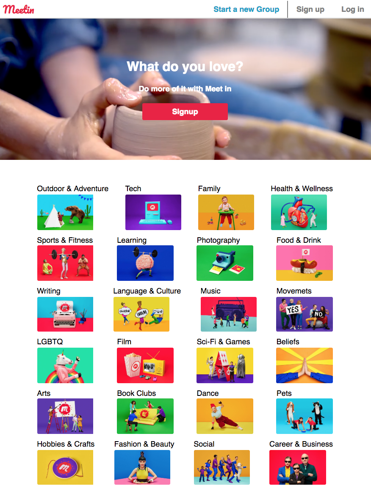
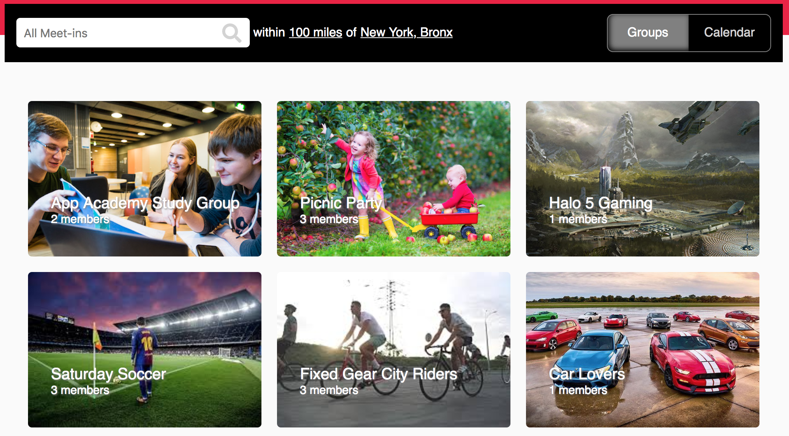
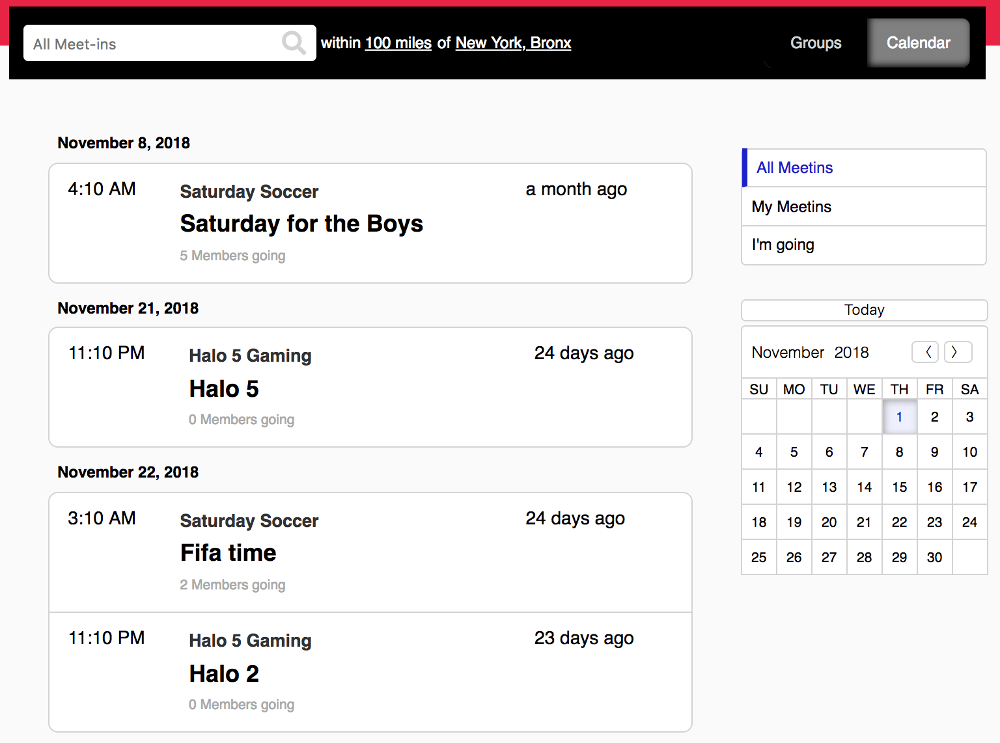
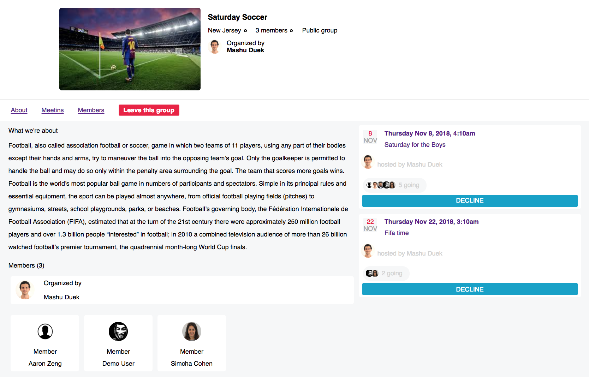
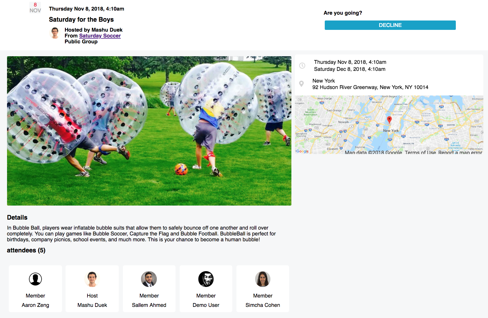
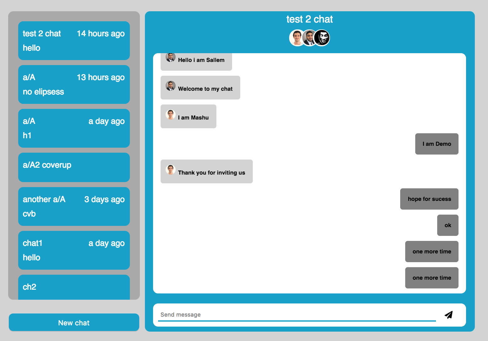

# Meetin
Meetin is a Meetup clone containing many of the cool features we know and love from Meetup.



Please click the link below to enjoy the cool features

(https://meet-in.herokuapp.com)


Some features include searching for events and groups. When you search for groups you are able to filter by:
* querysearch: which will select the groups by commonality in the group title and description.
* radial location: can find the nearest groups to you.

below is a snippet of code for groups postgreSQL search query using active record:

```ruby
  Group.where("((lng - :lng) * (lng - :lng)) + ((lat - :lat) * (lat - :lat)) < :r * :r", {lng: lng, lat:lat, r: r})
  .where("title iLIKE :querySearch OR description iLIKE :querySearch", querySearch: "%#{querySearch}%")
```




Event Search includes the same search features as the groups and also:
* date search: find events you can attend that do not conflict with your schedule.

below is a snippet of code for event postgreSQL search query using active record:

```ruby
  Event.where("((lng - :lng) * (lng - :lng)) + ((lat - :lat) * (lat - :lat)) < :r * :r", {lng: lng, lat:lat, r: r})
    .where("title iLIKE :querySearch OR detail iLIKE :querySearch", querySearch: "%#{querySearch}%")
    .where("start_date between :start_date AND :end_date", {start_date: start_date, end_date: end_date})
```



Moreover you can join groups and rsvp to events that interest you in your community




A bonus feature that allows each user to connect with the members with of their group instantly with the Meetin messaging section. you are able to create group chats with members that you have encountered on Meetin and members of groups that you are affiliated with.


